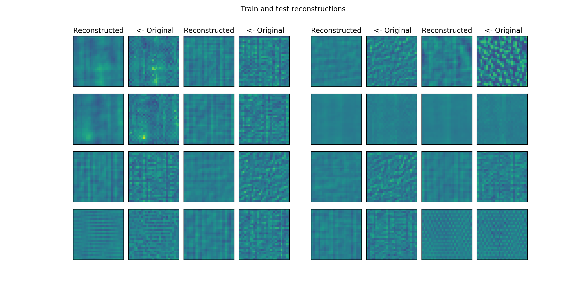
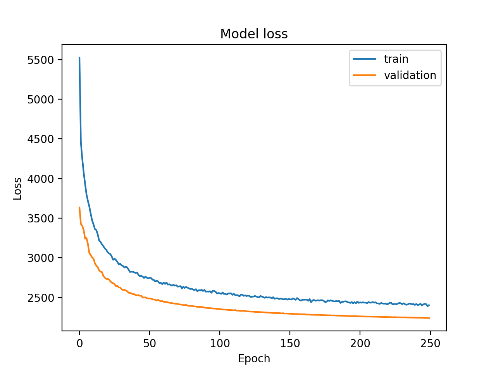
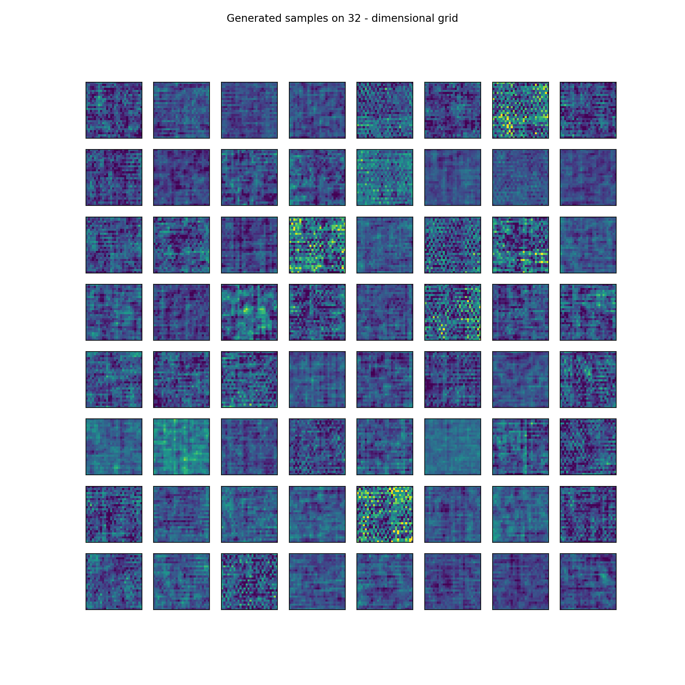

# Wigner-CSNL textures

### Variational Autoencoders on texture images for neuroscience
--------------------------

* using different datasets such as mnist, fashion-mnist, cifar-10, textures, natural textures
* binarization of images and zca-whitening is an option in loading time
    * zca-whitening is implemented from Keras source code
* training is available with random contrast generator
* differenct autoencoder, VAE and LVAE implementations are available

## VAE implementations


LVAE implementation


* also implemented traing time latent space generation, a GIF is saved during training from images generated from the same random sample on epoch end

* built python package that works with `tensorflow-1.14.0` and `tensorflow_probability-0.7.0` (!)

## Usage

* `attention` : not all datasets work with the same batch sizes (!)

```python
from csnl import DataGeneratorWithLabels, DataGenerator, \
    SmallDenseLadderVAE, VAEPlotter, ModelTrainer

data_gen_labels = DataGeneratorWithLabels(image_shape=(28, 28, 1),
                                          batch_size=100,
                                          file_path=os.getcwd() +
                                          '/csnl/data/textures_42000_28px.pkl',
                                          whiten=False, 
                                          binarize=False,
                                          contrast_normalize=True)

data_gen = DataGenerator(image_shape=(28, 28, 1),
                         batch_size=100,
                         file_path=os.getcwd() +
                         '/csnl/data/textures_42000_28px.pkl',
                         whiten=False, binarize=False, contrast_normalize=True)

```

* there are two datagenerators, basically the `...WithLabels` version is purely for analytical purposes
* for the `textures_42000_27px.pkl` dataset labelwise contrastnormalization is implemented to exclude all contrast differences between different categories
* binarization of images can be done

```python
LATENT_DIM1 = 16 * 8
LATENT_DIM2 = 16 * 2

vae = SmallDenseLadderVAE(input_shape=(100, 28 * 28),
                     latent_dim1=LATENT_DIM1,
                     latent_dim2=LATENT_DIM2)
```

* there are several models to choose from and they can be easilly built from different encoder and decoder blocks

```python
trainer = ModelTrainer(vae,
                       data_gen,
                       loss_fn="normal",
                       lr=5e-5,
                       decay=1e-5,
                       beta=1)

trainer.fit(4, 10, contrast=True, warm_up=True, make_gif=True)
```

* a model trainer handles everythin, the chosen architecture can be trained with additional artifical random contrast during training, warm up of the `beta` value and also a gif can be generated that show how the latent representation evolves during training

```python
plotter = VAEPlotter(trainer, data_gen, data_gen_labels, grid_size=8)

plotter.plot_contrast_correlations(latent_dim2=LATENT_DIM1)
plotter.plot_label_correlations()

plotter.grid_plot()

plotter.generate_samples()
```

* the plotter creates plots for analysis





