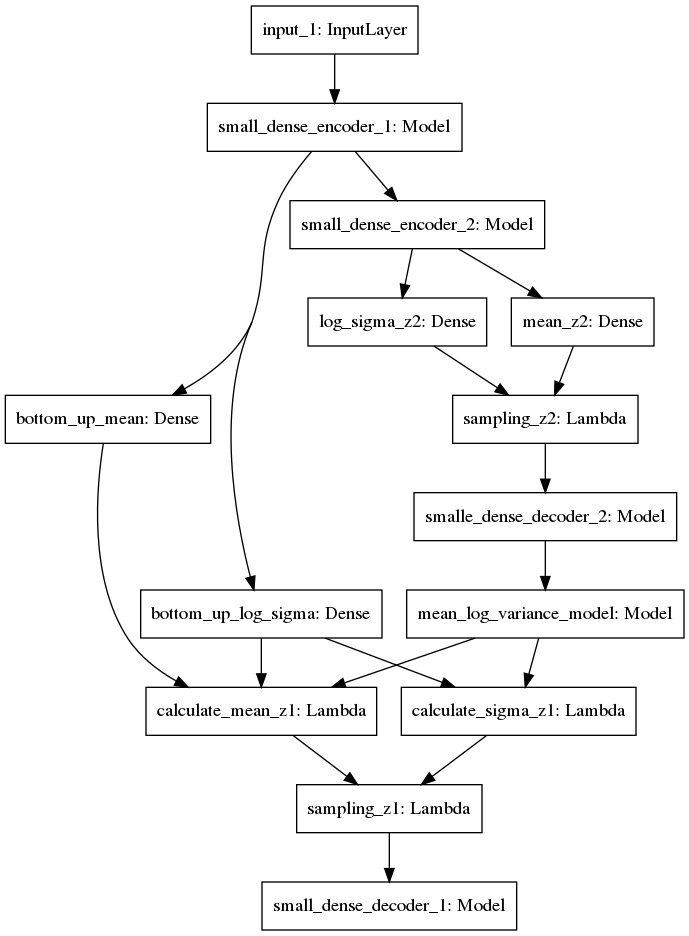

# Wigner-CSNL textures

Variational Autoencoders on texture images for neuroscience

* using different datasets such as mnist, fashion-mnist, cifar-10, textures, natural textures
* binarization of images and zca-whitening is an option in loading time
    * zca-whitening is implemented from Keras source code
* training is available with random contrast generator
* differenct autoencoder, VAE and LVAE implementations are available

VAE implementation

LVAE implementation

* also implemented traing time latent space generation, a GIF is saved during training from images generated from the same random sample on epoch end

* built python package that works with `tensorflow-1.13` and `tensorflow_probability-0.6.0` (!)